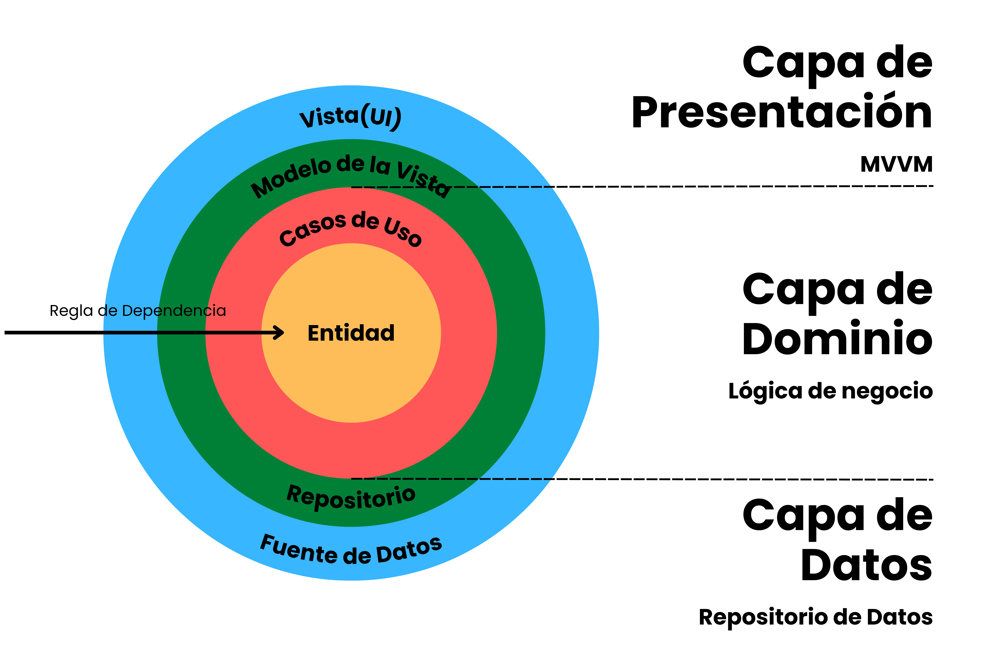
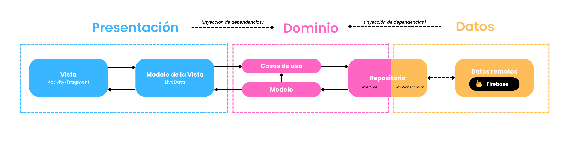

# Descripción

Demo app **Android**(escrita en *Kotlin*), dedicada a la <u>compra y venta online de zapatillas de segunda mano</u>. Una vez realizado el registro de usuario, se muestra un catálogo de zapatillas. Si estas interesado en comprar alguna, puedes hacer *tap* sobre en una de ellas para mostrar su vista de detalle. Además, puedes subir tus propios artículos para su venta posterior.

La aplicación utiliza *Cloud Firestore*(base de datos de documentos no-relacional) de *Firebase* para la autenticación, subida de productos, y el listado de artículos.
Implementa *Navigation Component*, de *Jetpack Compose*, para facilitar la navegación entre fragments/activities. También, incluye *LiveData*, un tipo de datos observables.
Uso de la librería *Dagger Hilt* para la inyección de dependencias y ViewBinding para facilitar la conexión de las vistas.

Software desarrollado y mantenido por [Donato Gómez](https://github.com/donatogomez), [Mikel Cobián](https://github.com/mikel-lab), [Conrado Capilla](https://github.com/conracapi) y [Samuel López](https://github.com/11samuelopez).

# Arquitectura
La app sigue el estándar de arquitectura **CLEAN** propuesto por ***Robert C. Martin***. La idea principal, es separar el software en capas independientes. Existen distintas formas de lograrlo. La más utilizada, se denomina arquitectura de tres capas: *Dominio, Datos y Presentación*.

## Dominio
Es la capa inferior y está aislada del resto. Contiene nuestros *modelos* de datos y los *casos de uso*.

## Data
Capa encargada de seleccionar las *fuentes de datos(repositorios)* para la capa de dominio.

## Presentación
Es la capa que interactúa con la interfaz de usuario y la que se encuentra más arriba. Incluye *Vistas(Activities/Fragments)* y *ViewModels*. Hemos utilizado el patron de diseño **MVVM** para modelarla.

# Stack tecnológico

* [Fragment](https://kotlinlang.org/) - Dependencia/Biblioteca para utilizar fragments.
* [Dagger Hilt](https://dagger.dev/hilt/) - Biblioteca de inyección de dependencias para Android.
* [View Binding](https://developer.android.com/topic/libraries/view-binding?hl=es-419) - Sistema de vinculación que permite enlazar los layouts(XMLs) con las clases(código Kotlin).
* [Jetpack Compose](https://developer.android.com/jetpack/compose?hl=es-419) - Kit de herramientas de Android para compilar IU nativas. Simplifica y acelera el desarrollo de la IU en Android.
  * [LiveData](https://developer.android.com/topic/libraries/architecture/livedata?hl=es-419) - Contenedor de datos observables optimizada para ciclos de vida.
  * [Navigation Component](https://developer.android.com/guide/navigation/navigation-getting-startedlive) - Componente para controlar el flujo entre los fragments y sus actions.
* [Firebase](https://firebase.google.com/) - Kit de herramientas en la nube que ofrece soluciones a problemas típicos en el desarrollo de nuestras aplicaciones.
  * [Firestore](https://firebase.google.com/docs/firestore) - Base de datos de documentos NoSQL de Firebase para el desarrollo de apps.
* [Android Studio](https://developer.android.com/studio) - IDE utilizado para desarrollar apps en Android.
* [Glide](https://bumptech.github.io/glide/) - Librería para carga de imágenes, videos y GIFs.
* [GSON](https://bumptech.github.io/glide/) - Librería para serialización/deserialización de objetos Java a JSON, y viceversa.

# Funcionalidades
  * Pantalla de Splash
  * Autenticación
    * Registro
    * Iniciar sesión
    * Restaurar contraseña
    * Mantener sesión iniciada
    * Cerrar sesión
  * Catálogo de productos
  * Search Bar

# Capturas de pantalla

  

# Licencia
<pre><code>MIT License

Copyright 2022 Guardia Imperial

Permission is hereby granted, free of charge, to any person obtaining a copy
of this software and associated documentation files (the "Software"), to deal
in the Software without restriction, including without limitation the rights
to use, copy, modify, merge, publish, distribute, sublicense, and/or sell
copies of the Software, and to permit persons to whom the Software is
furnished to do so, subject to the following conditions:

The above copyright notice and this permission notice shall be included in all
copies or substantial portions of the Software.

THE SOFTWARE IS PROVIDED "AS IS", WITHOUT WARRANTY OF ANY KIND, EXPRESS OR
IMPLIED, INCLUDING BUT NOT LIMITED TO THE WARRANTIES OF MERCHANTABILITY,
FITNESS FOR A PARTICULAR PURPOSE AND NONINFRINGEMENT. IN NO EVENT SHALL THE
AUTHORS OR COPYRIGHT HOLDERS BE LIABLE FOR ANY CLAIM, DAMAGES OR OTHER
LIABILITY, WHETHER IN AN ACTION OF CONTRACT, TORT OR OTHERWISE, ARISING FROM,
OUT OF OR IN CONNECTION WITH THE SOFTWARE OR THE USE OR OTHER DEALINGS IN THE
SOFTWARE.
</code></pre>
---

